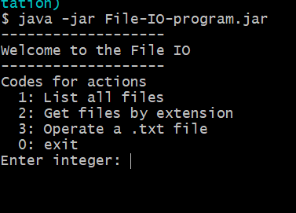
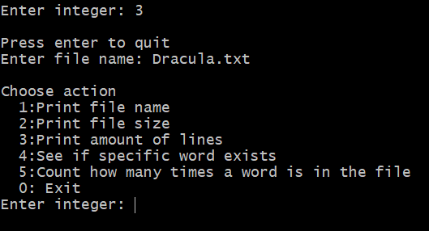
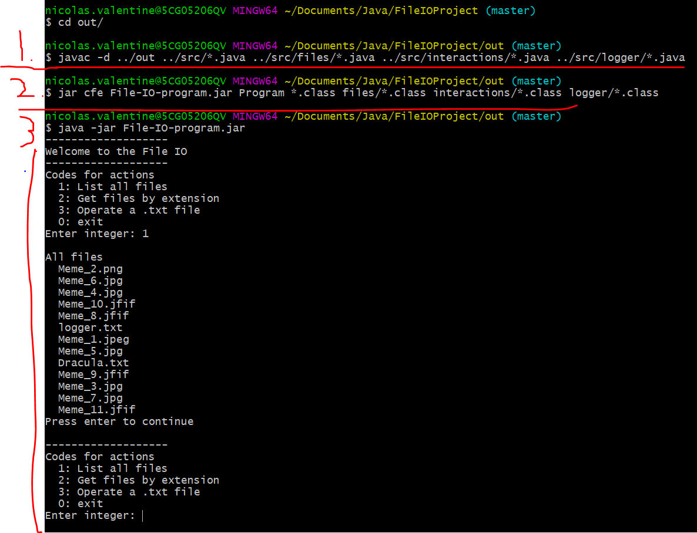

# Table of contents

- [Table of contents](#table-of-contents)
- [File IO Project](#file-io-project)
  - [Use cases](#use-cases)
    - [Main menu](#main-menu)
    - [Operating .txt file (option 3 in main menu)](#operating-txt-file-option-3-in-main-menu)
  - [Compiling, creating .jar and running program on git bash](#compiling-creating-jar-and-running-program-on-git-bash)
  - [Structure](#structure)
# File IO Project
Exercise description can be found
[ here](documents/Task2.pdf).

## Use cases
### Main menu 



From the main menu user can
1. List all files found in resource folder
2. List all file extensions from the resource folder
3. Operate .txt file from resource folder

### Operating .txt file (option 3 in main menu)

After entering operating menu from the main menu. User is asked a .txt file. After givin valid .txt file operating menu opens.



Here user can 
1. Print file name
2. Print file size
3. Print amount of lines in the file
4. Asks user a word and see if this word is found in the file
5. Asks user a word and counts how many times the word is in the file

Actions from 3-5 are logged into resources/logger.txt file. Logging contains timestamp, message and the time it took to perform.

## Compiling, creating .jar and running program on git bash


1. Compile the project to /out package
2. Create .jar file
3. Running program
4. Voila!

## Structure
```
File IO
|   README.md
|   .gitignore
|
|--documents
|  |  pic1.PNG
|
|--out
|  |  Program.class
|  |  File-IO-program.jar
|  |
|  |--files
|  |  Files.class
|  |
|  |--interactions
|  |  UserInteractions.class
|  |
|  |--logger
|  |  Logger.class
|
|--src
|  |  Program.java
|  |
|  |--files
|  |  Files.java
|  |
|  |--interactions
|  |  UserInteractions.java
|  |
|  |--logger
|  |  Logger.java
|  |
|  |--resources
|     Dracula.txt
|     logger.txt
|     ... pictures and memes
```